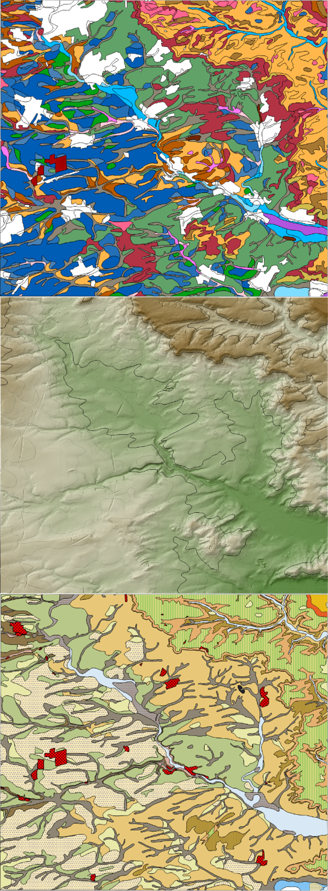

GEO-77 Introduction to R
================
Mathias Bellat
2024-10-22

# Preface

This is an introduction course to R language applied for Physical
Geographical science in **GEO77** teaching.

This course will help you with the basis of R language and first uses of
Machine Learning.

**General info:**

- Name and email: Mathias Bellat Ph.D. candidate, SFB1070
  ResourcesCultures, Working group geomorphology and soil sciences.
  Email : <mathias.bellat@uni-tuebingen.de>.
- Dates: 22/10, 29/10, 5/11 and 12/11
- Language: English.
- Working time: 4 hours during class and around 3 - 4 hours weekly at
  home (extra readings and exercises).
- Resources: In the “Reference chapter” and on the ILLAS webpage
  [GEO77](https://ovidius.uni-tuebingen.de/ilias3/goto.php?target=crs_3872795&client_id=pr02)
  with the password “**SoilScience**”.

**Objectives:**

- Get basic of R language under *RStudio*, different type of features,
  writing an algorithms, importing and exporting data.
- Importing geo-referenced data into *R*.
- Digital soil mapping of soil properties into different environmental
  contexts.
